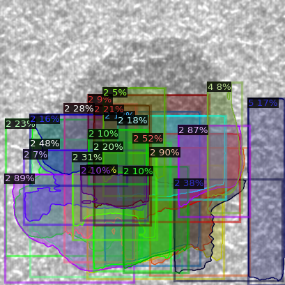
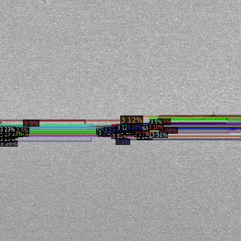
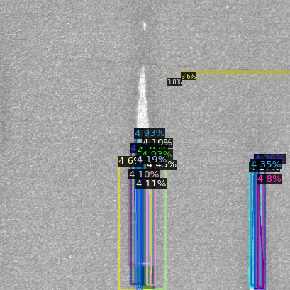
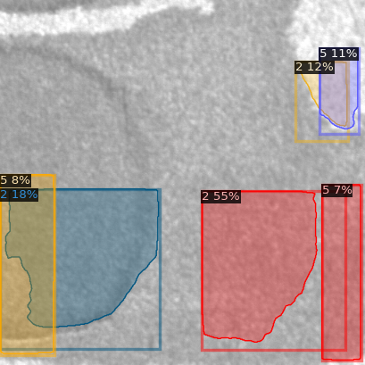
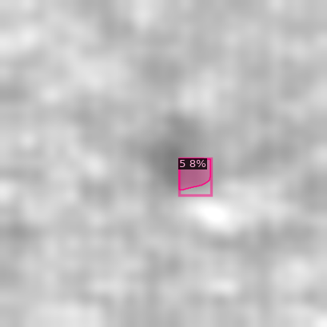

# industrial_defect_detection

## Introduction

Use deep learning to detect industrial defect. We want to not only classify the defect category but also detect the defect area of the industial defect.

## Method

First we classify the defect into 6 categories: 1 normal and 6 different defects: void, horizontal, vertical, edges, particle. Then we choose 50 images from each category as train and the other 50 as validation. We label the data using [VGG image annotator](https://www.robots.ox.ac.uk/~vgg/software/via/via_demo.html). Then we parse the label json file to COCO label format in order to send into [Detectron2](https://github.com/facebookresearch/detectron2) for training and validation.

## Result

Defect1: void

Defect2: horizontal

Defect3: vertical

Defect4: edge
 
Defect5: particle